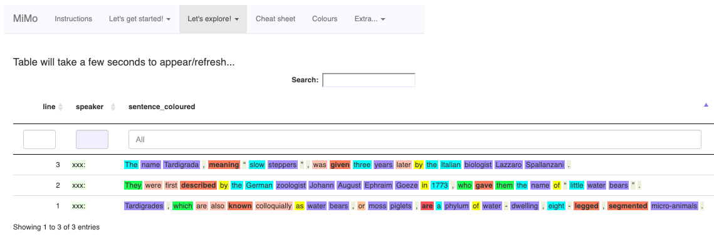
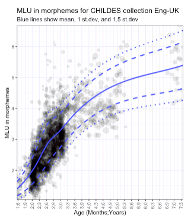
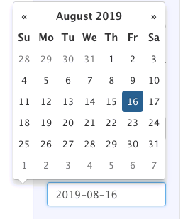

        
```{r setup, include=FALSE}
knitr::opts_chunk$set(echo = TRUE)
```


        
# Welcome to the MiMo language analysis tool!

## What is MiMo?

The name MiMo stands for "Minimal Input, Maximal Output".

**Minimal Input**

MiMo allows you to enter text **quickly** and **efficiently** without needing to learn special conventions.

**Maximal Output**

MiMo provides a **rich output**, automatically identifying complex sentences, and colouring in words according to their word class so you can 'see' the structure of sentences.

## Other reasons for using MiMo

1. It is **cross platform**. Because it runs as a web app you can use it on Mac, PC and Linux, and even on mobile phones and tablets (Android and Apple iOS)

2. It works in **over 60 different languages**. So if a child speaks Ancient Coptic, you know where to turn!

3. It is completely **open source** so anyone with sufficient technical knowledge can adapt it to their own ends.

4. It provides **up-to-date norms** from the **Childes** database

## Who is MiMo intended for?

The app is aimed at Speech and Language Therapists, and other language professionals, who want to do a quick and easy analysis of language data. It is **not** intended as a tool for researchers. A better alternative for research purposes is the [CLAN software and CHAT transcription system](https://talkbank.org/).

## Viewing these help pages

If you wish to see a version of these help pages with a **handy navigation menu**, please click [here](Rmarkdown_instructions.html). You may also wish to download a [Word](Rmarkdown_instructions.docx) and [pdf](Rmarkdown_instructions.pdf) version of these help pages.

## Brief Acknowledgements

MiMO couldn't have been writting without the R programming language, the R Shiny Apps framework, and the CHILDES database of child language corpora. I should also thank my institution, Newcastle University, for supporting me. See the end of the document for further acknowledgements.

# **Basic Usage**

## <font color = "red"> PRACTICE 1 - Entering data </font>
<font color = "#911f1f">
1. Select `Let's get started!` (at the top of the page) > `(1) Enter text`

2. Click the Radio Button `Enter text in textbox`, and enter your text-to-be-analysed in the text box. Here is some text for you to copy and paste into the text box.

<blockquote>

Tardigrades, which are also known colloquially as water bears, or moss piglets, are a phylum of water-dwelling, eight-legged, segmented micro-animals. They were first described by the German zoologist Johann August Ephraim Goeze in 1773, who gave them the name of "little water bears". The name Tardigrada, meaning "slow steppers", was given three years later by the Italian biologist Lazzaro Spallanzani.

</blockquote>

3. Then select `Let's get started!` (at the top of the page) > `(2) Check language`

4. If the language detected is correct (it *will* be correct if you enter the above text), proceed to `Let's explore!` > `(2) Coloured output`

5. You should see a colourful table with word classes shaded according to their colour...

</font>



## Exploring the coloured output

You can do a lot of cool things with the table.

### ...Mouse hovering...

If you hover the mouse over a word, you will see a "tooltip" showing the grammatical category of that word. Give it a try!

### ...Filtering...

If you enter text in one of the boxes at the top, you can select (or "filter") particular lines

For example, if you type `hasPron` in the big search bar at the top of the screen, it will find all sentences containing pronouns, or if you type `hasCopula` it will find sentences containing the copula (verb "to be" when used as the MAIN VERB). Give it a try!

You will find a list of search terms in `Cheatsheet` tab.

### ...Sorting...

You can also sort lines

### ...Highlighting lines...

If you click on lines they will be shaded in dark grey. This may be useful if you wish to highlight particular lines in the transcript.

NB don't scroll too far along, as many of the columns are slightly scary-looking are not designed to be looked at by the user! In general, there is no need to look at colunms beyond the vertical line.

## A note on parsing accuracy

'Parsing' is the process of identifying word classes (and other syntactic) information from text. MiMo depends on Universal Dependencies annotation scheme. The Universal Dependency project is an international project designed to create parsing models of the world’s languages. Though the Universal Dependencies do a fantastic job, they are only around 95% accurate. This should be borne in mind when using MiMo to analyse natural language data.

## <font color="red"> PRACTICE 2 - Filtering and sorting </font>

<font color = "#911f1f">
(a) Practice filtering the lines. Type individual words in the small search box above the coloured text. NB you can also search for groups of words, but **this will only work if you type them in the "universal" search bar**

(b) Now practice filtering for word classes. Type `hasPron` and `hasCopula` into the "Universal" search bar (the large bar at the top)

(c) Now practice sorting. Go to the `num_clauses` column, and sort so that the sentences with the most clauses are at the top. </font>
</font>

## Specifying speakers

The above text on Tardigrades does not specify a speaker. Note that in the speaker column the "speaker" is specifed as `xxx:`, i.e. some unknown individual.

If you wish to specify speakers, merely type a word at the beginning of an utterance which ends in a colon, e.g. `Jack: CHI: Mum: babysitter:`. Once you have specified a speaker then all the following lines are assumed to belong to that speaker *unless another speaker is specified*.

## <font color = "red"> PRACTICE 3 - Specifying speakers </font>
<font color = "#911f1f">
Try entering the following conversation in the text box, and then check the language.

<blockquote>

CHI: Gimme that!
ADULT: Can you say "Please"?
CHI: Gimme please!
ADULT: That's right.
Here you go.
What do you think that is?

</blockquote>

You will notice that the language detection doesn't quite work. This is because the algorithm prioritises speed over accuracy. To set the right language, click on the radio button `Select another language` and then enter the name of the language ("English") in the box (make sure you spell it correctly or the app will crash).

Now have a look at the coloured output. You will see that the speakers have been added to the Speaker column.
</font>

## Delimiting utterances

The following characters are utterance-final delimiters:

1. One or more periods (full stops) in a row, e.g. . .. ... ....
2. One or more question marks in a row, e.g. ? ?? ??? ????
3. One or more exclamation marks in a row, e.g. ! !! !!! !!!!
4. A return (new line) character

Note that the RETURN character is not defined as an utterance-infal delimiter. This means that you do not need to bother to enter RETURN characters. So you could enter all utterances as below without any RETURN character. MiMo would only assume a new line where it identifies an utterance-final delimiter.

<blockquote>

CHI: Gimme that!
ADULT: Can you say "Please"?
CHI: Gimme please! 
ADULT: That's right. Here you go. What do you think that is?

</blockquote>

Note that there is one punctuation convention that is specific to MiMo. When typing out a COMMAND, finish the sentence with a single exclamation mark, e.g. "Eat your dinner!/Put down that toy!". When typing out an EXCLAMATION, finish the sentence with **more than one** exclamation mark, e.g. "We had such a nice time!! That's such a funny toy!!"

# **Intermediate usage**

## Uploading documents

You will note that the app gives you the opportunity to upload a document. You can upload a Microsoft Word format document (with the extension .doc, or docx) or a plain text file (with the extension .txt). Unfortunately R cannot recognise other formats (e.g. .odt).

## <font color = "red"> PRACTICE 4 - uploading a text document </font>
<font color = "#911f1f">
Try creating a document with some text in and uploading it.
</font>

## More about filters

You can see that there are two types of filters...


(1) A "specific" filter which is shown at the top of columns. This only searches inside the column.
(2) A "universal" filter at the top in the middle. This filter can be used to search for text in ANY column. The universal filters are described in the `Cheat sheet` tab.

All of these filters are blind to case, so they will work if you use upper instead of lower case and vice versa. So `hasPreposition`, `haspreposition` and `HASPREPOSITION` will all do the same thing. Note that for filters to work, you only need to type **the minimum string which identifies a specific filter from a list of all filters**. So you are likely to see the columns being filtered even before you have finished typing them.

The filters are designed so that you can explore the data. You can do a whole host of things including

(a) Identifying the more complex utterances
(b) Finding particular structures (e.g. passives)
(c) Searching for word classes
(d) Searching for tags you have added (see below)

## <font color = "red"> PRACTICE 5 - Using filters, PART 2 </font>
<font color = "#911f1f">
Have a go at using the filters with the following transcript (invented by the author)

<blockquote>

ADULT: Look. Look at the car.
CHILD: Yes. Car!! That's a blue one.
ADULT: Yes it is, isn't it?
CHILD: Yes, it is.
ADULT: Can you make it go.
CHILD: I can make it.... I make it go very fast. Watch me! This is the car that Cookie Monster drives. Look! It got real smashed! I put it in the box now.
ADULT: That's right. You're putting it in the box.

</blockquote>

Now copy and paste this into the MiMo, and look at the `Let's explore!` > `(1) Coloured table` tab. Now use the sorting and filtering functions to

(1) Find sentences produced by the child containing prepositions.
(2) Find sentences produced by the child containing pronouns.
(3) Find sentences produced by the child containing an exclamation (note exclamations have 2 exclamation marks, while imperatives have only one).
(4) Find sentences produced by the child containing an imperative.
(5) Find sentences produced by the child containing a present participle form.
(6) Find sentences produced by the child containing a past participle form.
(7) Rank the child's sentences in terms of length or complexity.
(8) Calculate the percentage of the child's utterances which are complex (multi-clausal) (NB, to do this have a look at the numbers at the bottom table, e.g. "Showing 1 to 3 of 3 entries" which show you the number of rows which have been selected)

</font>

## Language metrics

 Now go to `(2) Syntactic measures` . This tab shows you (a) a table with important syntactic metrics (Mean Length of Utterance in words (MLUw), Mean Length of Utterance in Morphemes (MLUm), Mean Number of Finite Clauses per utterance (MNumCl), Mean Length of Turn (MLT)) and (b) a graph showing developmental trends in the CHILDES corpora. To view the CHILDES graph, you'll need to select a `Collection` on the left hand side, and then the graph will become visible. It looks something like this...



The trend lines show the mean score, plus and minus 1 standard deviation, and plus and minus 1.5 standard deviations. The `Nitty Gritty` section (below) contains information about how these lines have been calculated and drawn.

## <font color = "red"> PRACTICE 6 - Exploring CHILDES corpora </font>
<font color = "#911f1f">
Load a variety of different corpora to look at developmental trends.
</font>

In the *Advanced Usage* section below there is further information on how to alter the appearance of the graph, and plot a data point for a particular child.

In addition, you should explore the `(3) Lexical measures` tab. This contains two measure of lexcical diversity: "HDD", and Type Token Ratio (TTR). HDD stands for "Hypergeometric Distribution Density". It is virtually identical to the VOC-D metric which is calculated by the CLAN language analysis software. For example, McCarthy and Jarvis (2007) found correlations of r = 0.971 between HDD and VOC-D (McCarthy, P.M., Jarvis, S., Vocd: A theoretical and empirical evaluation, *Language Testing*, 2007.[https://doi-org.libproxy.ncl.ac.uk/10.1177/0265532207080767](https://doi-org.libproxy.ncl.ac.uk/10.1177/0265532207080767)).

## Comments and tags

Use comments and tags for sections of text which you do not want MiMo to analyse (e.g. categorise them according to their word class, or use them as the basis for calculating MLU). Comments are marked using round brackets, while tags are marked using square brackets, e.g.

(this is a comment) [and this is tag]

The only difference between a comment and a tag is that you can search for content within tags (using the "hasTagCONTENT_OF_TAG" universal filter), and there is also a tab which provides summary data for the tags.

## <font color = "red"> PRACTICE 7 - Exploring CHILDES corpora </font>
<font color = "#911f1f">

To explore content and tags, copy and analyse the following fragment. This is the same as the above chunk, but tags have been added containing rudimentary speech acts. I have also used tags and comments to codify a reformulated utterance. Note that by making the reformulated chunk a comment (by enclosing it in round brackets) it will not be used to calculate the metrics (e.g. MLU)

<blockquote>

ADULT: Look! [directive] Look at the car. [directive]
CHILD: Yes. [oneWordResponseToDirective] Car!! [exclamative] That's a blue one. [comment]
ADULT: Yes it is, isn't it? [comment]
CHILD: Yes, it is. [comment]
ADULT: Can you make it go? [interrogative]
CHILD: (I can make it)[reformulated] I make it go very fast. [comment] Watch me! [directive] This is the car that Cookie Monster drives. [comment] Look! [directive] It got real smashed. [comment] I put it in the box now. [comment]
ADULT: That's right. [comment] You're putting it in the box. [comment]

</blockquote>

Copy and paste this into MiMo and have a look at the coloured table. You can now search for specific tags using "hastagCONTENTS", e.g. "hastagDirective".

</font>

Comments and tags are designed to be *simple* to use but also *highly flexible*. You could use them to analyse almost any aspect of linguistic data.

In addition to allowing you to use tags and comments, the app also summarises tag data. To see a summary go to `Let's explore` > `(4) Tags` (note if the there are many tags you will need to scroll horizontally to see them all). The Tags tab will show you on how many of these tags occur per utterance for that particular speaker. From this it is easy to calculate the percentage of utterances involving reforumulations.


## <font color = "red"> PRACTICE 8 - Exploring the "(4) Tags" tab </font>
<font color = "#911f1f">

Copy and paste the above transcript into the text box, and then go to the `(4) Tags` tab. What percentage of the adult's utterances contain directives?

</font>

## Lexical measures

Now go to `Let's explore!` > `(3) Lexical measures`. You will see a report with lexical diversity statistics for each speaker; "HDD" and "TTR" (Type Token Ratio). "HDD" is the more reliable of the two measures because it is unaffected by sample length, unlike TTR.


## <font color = "red"> PRACTICE 9 - Exploring the "(4) Tags" tab </font>
<font color = "#911f1f">

Copy and paste the above transcript into the text box, and then go to the `(4) Tags` tab. What percentage of the adult's utterances contain directives?

</font>

Again, the *Advanced Usage* section provides information on how to alter the appearance of the graph, and plot a data point for a particular child.

# **Advanced Usage**

## Changing the appearance of graphs

### Zooming

You can **zoom into** the graph by selecting and area with the mouse, and double-clicking on that area. Zooming does not redraw the lines of fit (means and standard deviations).

You can also **trim** the data, by selecting the `trim` slider. This enables you to remove observations for children at the extremes of the age range. After the data is trimmed then the lines of best fit are redrawn (unlike zooming, which does not redraw the lines). Trimming can be useful for some corpora where much older children can skew the lines of best fit. In this case, by removing the older children, we can straighten the lines. It is very unlikely that you will need to trim the younger children.

### Plotting children on the graphs

You also have the ability to plot an individual child on the graph. To do this, select the child from the drop-down, enter the age of the child, and the age of the child at "test" (i.e. the date when the child was recorded).



The age for the child will be calculated, and a red marker corresponding to that child will be shown on the graph.

### Changing the shading of the graphs

This may be achieved using the "shading" slider. Sometimes when there are many datapoints, the graph will be excessively dark, and the shade will need to be lightened.

### Changing the minimum number of utterances

The graphs are drawn using corpora where the children produce a minimum number of utterances. The reason for this is that language measures (MLU, HDD) are not reliable unless the transcript is sufficiently large. The minimum number of utterances is set at 100. It is possible to change this. By increasing the number we are improving the reliability of each data point, but we are reducing the number of datapoints, which may in turn affect the reliability of the lines of fit.

### Changing the width of the bins

The lines of best fit are created by grouping the children into "bins" of a pre-specified size. This may be altered. By increasing the bin size the lines become smoother, but are likely to fit the data less well.

## <font color = "red"> PRACTICE 10 - Changing the appearnce of graphs" tab </font>
<font color = "#911f1f">

Copy and paste the above transcript into the text box, and then go to the `(2) Syntactic measures` tab, of the `(3) Lexical meausures` tab. Select one of the corpora to draw the graph. Now that the graph is drawn experiment with its appearance by 

(1) zooming in
(2) trimming the data at the extremes
(3) changing the shade of the graph
(4) changing the minimum number of the utterances
(5) changing the size of the bins

Now select the child participant from the dropdown and plot their data on the graph (NB to do this, you will need to enter a random age for the child)

</font>

## Extras (1) - Coloured Output CnP

There are two "extra" tabs on the right hand side. The first entitled `(1) Coloured Output CnP` provides a simpler version of the Coloured Output which allows you to copy individual lines and paste them into other document (you may found out that copying and pasting does not work very well for the `(1) Coloured Output` tab. This may be useful if you writing a report, and wish to give examples of the child's language.

## Extras (2) - DIY Figure

The second "extra" tab is called `(2) DIY Figure`. This creates CHILDES plots just like tabs (2) and (3) under `Let's explore`. However, whereas the former are designed to work with the statistics produced by MiMo, the latter allows you to enter the data for a specific child without using MiMo to do your analysis.

## Nitty Gritty

# How metrics are calculated

Words are assumed to be separated by spaces. If you want to treat two words as a single word, remove the space between them, e.g. `cheese biscuit` > `cheesebiscuit`. You can check that it has been analysed as a single word in the Coloured Output tab.

Morphemes are slightly trickier. Unfortunately, the software does not do a sophisticated morphological analysis, but instead operates with a simple set of rules.

1. *Regular past tense affix -ed*: if a word is analysed as a past tense verb and ends `-ed` it is coded as having a regular past tense morpheme.
2. *Third person singular present tense -s*: if a word is recognised as a third person singular present tense verb, and it ends in `-s` it is coded as having a third person singular present tense morpheme.
3. *Regular plural -s*: if a word is coded as a plural noun and ends in `-s` it is coded as having a plural suffix.

And that's all there is to it! Though these rules are fairly basic they are very reliable, as all of these morphemes or orthographically encoded in a regular fashion, e.g. all regular past tense endings are written "ed".

Note that this set of rules is language specific. Therefore MLUs in morphemes for languages other than English will not be accurate. However, there is no reason why further sets of morphological rules for different languages cannot be added to MiMo.

# How means and standard deviations are drawn

The lines have been drawn via a two-stage process. Firstly, "rolling" means and standard deviations are calculated. This involves ranking observations by age, and taking a set (or "bin") of a pre-specified size (the default size is 10). Then means, and standard deviations are calculated. After that, the bin is shifted upwards by 1. So while the first bin contains observations 1 to 10, the second contains observations 2 to 11. The third bin will contain observations 3 to 12 and so on. Note that when we approach the extremes the bins will become smaller than their prespecified size, which will affect the reliability of the means / standard deviations.

The second stage of the process is slightly more complicated. R uses an algorithm called "loess" to draw a smooth line through the rolling means and standard deviations. "Loess" is complex and difficult to describe without using heavy maths. 

# How the software works

This section is only for people who understand the coding language `R`!!

The software is written using the *Shiny Apps* `R` package. It loads a variety of libraries. The two most important ones which involve linguistic data are `childesr` for reading data from CHILDES corpora, and `udpipe`, which "parses" the natural language input (i.e. it analyses the structure of sentences and assigns word classes). The software also uses the `korpus` library for calculating the lexical diversity metrics. All of the libraries loaded by the software are listed in the *Acknowledgements* section below.

The code will eventually be hosted on **github**.

# Acknowledgements

The software is written by [nick riches](nick.riches@newcastle.ac.uk) using the following R packages...

Functions for plotting and data manipulation:

  Hadley Wickham (2017). tidyverse: Easily Install and Load the 'Tidyverse'.
  R package version 1.2.1.
  https://CRAN.R-project.org/package=tidyverse

Functions for accessing statistics from CHILDES corpora:

  Mika Braginsky, Alessandro Sanchez and
  Daniel Yurovsky (2019). childesr:
  Accessing the 'CHILDES' Database. R
  package version 0.1.1.
  https://CRAN.R-project.org/package=childesr

Functions for creating documents:

  Yihui Xie (2014) knitr: A Comprehensive
  Tool for Reproducible Research in R. In
  Victoria Stodden, Friedrich Leisch and
  Roger D. Peng, editors, Implementing
  Reproducible Computational Research.
  Chapman and Hall/CRC. ISBN
  978-1466561595
  
Functions for importing text files and Word documents:
  
  Kenneth Benoit and Adam Obeng (2019).
  readtext: Import and Handling for Plain
  and Formatted Text Files. R package
  version 0.74.
  https://CRAN.R-project.org/package=readtext
  
Functions for importing grammars from the Universal Dependencies database:  

  Jan Wijffels (2019). udpipe:
  Tokenization, Parts of Speech Tagging,
  Lemmatization and Dependency Parsing
  with the 'UDPipe' 'NLP' Toolkit. R
  package version 0.8.2.
  https://CRAN.R-project.org/package=udpipe
  
  
  Yihui Xie, Joe Cheng and Xianying Tan
  (2019). DT: A Wrapper of the JavaScript
  Library 'DataTables'. R package version
  0.6.
  https://CRAN.R-project.org/package=DT
  
  Hornik K, Mair P, Rauch J, Geiger W,
  Buchta C, Feinerer I (2013). “The textcat
  Package for $n$-Gram Based Text
  Categorization in R.” _Journal of
  Statistical Software_, *52*(6), 1-17. doi:
  10.18637/jss.v052.i06 (URL:
  https://doi.org/10.18637/jss.v052.i06).

  Jared E. Knowles (2019). eeptools:
  Convenience Functions for Education
  Data. R package version 1.2.2.
  https://CRAN.R-project.org/package=eeptools
  
  Yihui Xie, Joe Cheng and Xianying Tan
  (2019). DT: A Wrapper of the JavaScript
  Library 'DataTables'. R package version
  0.6.
  https://CRAN.R-project.org/package=DT
  
  Achim Zeileis and Gabor Grothendieck
  (2005). zoo: S3 Infrastructure for
  Regular and Irregular Time Series.
  Journal of Statistical Software, 14(6),
  1-27. doi:10.18637/jss.v014.i06

  Dean Attali (2017). colourpicker: A
  Colour Picker Tool for Shiny and for
  Selecting Colours in Plots. R package
  version 1.0.
  https://CRAN.R-project.org/package=colourpicker
  
And last, but not least, the citation for R itself and Shiny Apps
  
  R Core Team (2019). R: A language and
  environment for statistical computing. R
  Foundation for Statistical Computing,
  Vienna, Austria. URL
  https://www.R-project.org/.
  
  Winston Chang, Joe Cheng, JJ
  Allaire, Yihui Xie and Jonathan
  McPherson (2019). shiny: Web
  Application Framework for R. R
  package version 1.3.2.
  https://CRAN.R-project.org/package=shiny


